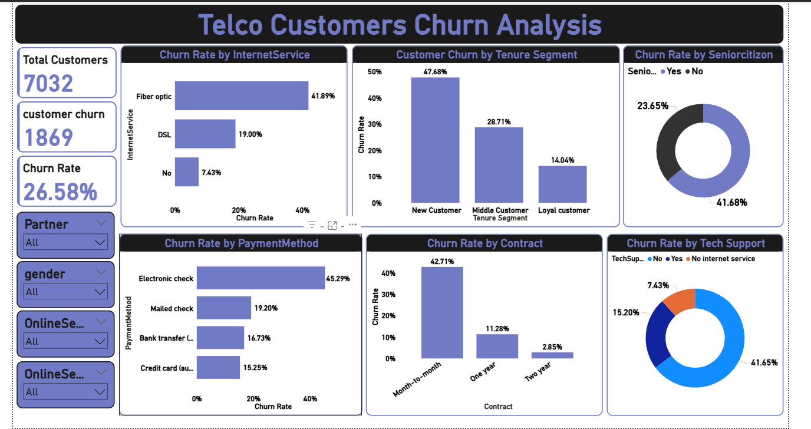

# Telecom-customer-churn

# Project Overview
•	Business Problem: Telecom company is losing customers. Identify patterns, insights, and actionable recommendations to reduce churn.
•	Dataset: Telco Customer Churn Dataset

# Summary

 - Analyzed customer churn dataset ( 26.5% churn) to identify key drivers such as new customers (47.7% churn), month-to-month contracts (43%), and lack of support services (42%).
 
 – Built an interactive Power BI dashboard to visualize churn across demographics, contract types, services, and payment methods.
 
 – Applied SQL for segmentation and deep-dive analysis, uncovering hidden churn factors like electronic check payments (45 % churn).
 
 – Recommended actionable strategies (improved onboarding, bundled support services, long-term contract incentives, payment method optimization).
 
 – Projected 8–10 Percentage churn reduction

# Power BI Dashboard



# SQL 

-- total customer
```
Select count(*) from CustomerChurn;
```
-- 7032

-- total churn
```
select sum(case when churn = 'Yes' then 1 else 0 end) as total_churn
from CustomerChurn;
```
-- 1869

-- churn rate
```
select round(sum(case when churn = 'Yes' then 1 else 0 end) * 100.0 / count(*),2) as churn_rate
from CustomerChurn;
```
-- 26.58 %


-- Q Gender vs churn

```
select 
	Gender,
    sum(case when churn = 'Yes' then 1 else 0 end) as churn,
    round(sum(case when churn = 'Yes' then 1 else 0 end) * 100.0 / count(*),2) as churn_rate
from CustomerChurn
group by 1;
```
-- ----------------------------------------------------------------------------------------------------------------------------------------------------------------

-- seniorcitizen vs churn

```
select
	Seniorcitizen,
    sum(case when churn = 'Yes' then 1 else 0 end) as churn,
    count(*) as total_customer,
     round(sum(case when churn = 'Yes' then 1 else 0 end) * 100.0 / count(*),2) as churn_rate
from customerchurn
group by 1;
```

-- ---------------------------------------------------------------------------------------------------------------------------------------------------

-- Partner vs churn

```
select 
	Partner,
    sum(case when churn = 'Yes' then 1 else 0 end) as churn,
    count(*) as total_customer,
     round(sum(case when churn = 'Yes' then 1 else 0 end) * 100.0 / count(*),2) as churn_rate
from customerchurn
group by 1;
```

-- -------------------------------------------------------------------------------------------------------------------------------------------

-- tenure vs churn

```
select 
	case when tenure > 0 and tenure <= 12 then 'New customer' 
		 when tenure >= 13 and tenure <= 24 then 'middle customer'
	else 'Loyal customer' end as tenure_segment,
	sum(case when churn = 'Yes' then 1 else 0 end) as churn,
    count(*) as total_customer,
	round(sum(case when churn = 'Yes' then 1 else 0 end) * 100.0 / count(*),2) as churn_rate
from customerchurn
group by 1;
```

-------------------------------------------------------------------------------------------------------

-- internet service vs churn

```
select
	internetservice,
    sum(case when churn = 'Yes' then 1 else 0 end) as churn,
    count(*) as total_customer,
	round(sum(case when churn = 'Yes' then 1 else 0 end) * 100.0 / count(*),2) as churn_rate
from customerchurn
group by 1;
```

-- ------------------------------------------------------------------------------------------------------------------------

-- paymentmethod vs churn

```
select
	Paymentmethod,
    sum(case when churn = 'Yes' then 1 else 0 end) as churn,
    count(*) as total_customer,
	round(sum(case when churn = 'Yes' then 1 else 0 end) * 100.0 / count(*),2) as churn_rate
from customerchurn
group by 1
order by 2 desc;
```

-- ------------------------------------------------------------------------------------------------------------------------------------

-- contract vs churn

```
select
	contract,
    sum(case when churn = 'Yes' then 1 else 0 end) as churn,
    count(*) as total_customer,
	round(sum(case when churn = 'Yes' then 1 else 0 end) * 100.0 / count(*),2) as churn_rate
from customerchurn
group by 1;
```
-- ---------------------------------------------------------------------------------------------------------------------------------

-- techsupport vs churn

```
select
	techsupport,
    sum(case when churn = 'Yes' then 1 else 0 end) as churn,
    count(*) as total_customer,
	round(sum(case when churn = 'Yes' then 1 else 0 end) * 100.0 / count(*),2) as churn_rate
from customerchurn
group by 1;
```
-- -----------------------------------------------------------------------------------------------------------------------------------------------

-- onlinesecurity vs churn

```
select
	onlinesecurity,
    sum(case when churn = 'Yes' then 1 else 0 end) as churn,
    count(*) as total_customer,
	round(sum(case when churn = 'Yes' then 1 else 0 end) * 100.0 / count(*),2) as churn_rate
from customerchurn
group by 1;
```

-- --------------------------------------------------------------------------------------------------------

-- Average monthly charge churn

```
select 
	churn, 
	round(avg(monthlycharges),2) as avg_monthly_charge
from customerchurn
group by 1;
```

```
SELECT 
    FLOOR(MonthlyCharges/10)*10 AS ChargeRange, 
    COUNT(CASE WHEN Churn = 'Yes' THEN 1 END) * 100.0 / COUNT(*) AS ChurnRate
FROM CustomerChurn
GROUP BY FLOOR(MonthlyCharges/10)*10
ORDER BY 2 desc;
```
